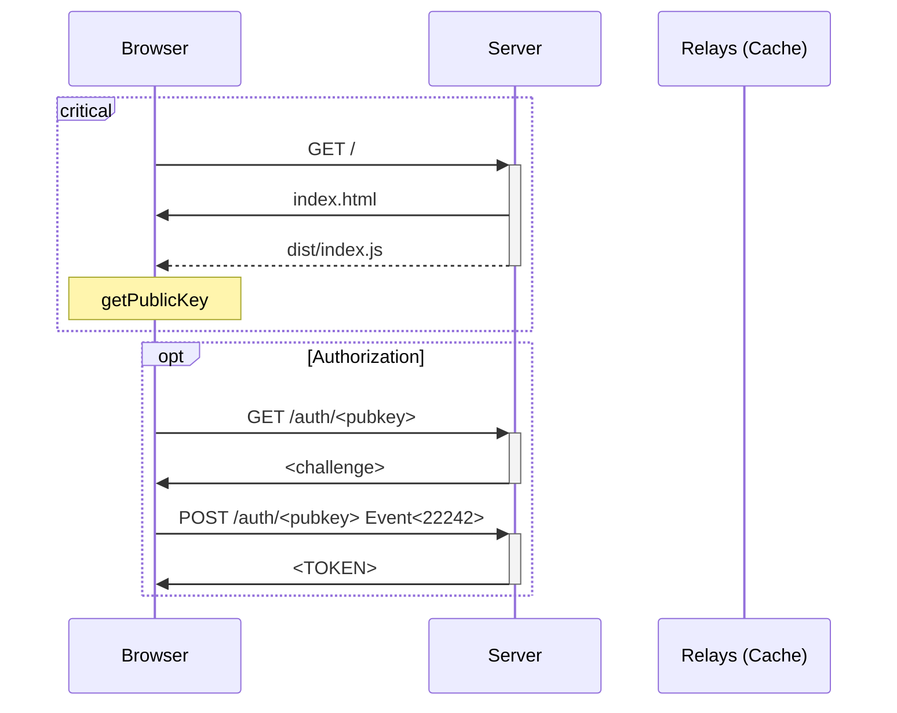
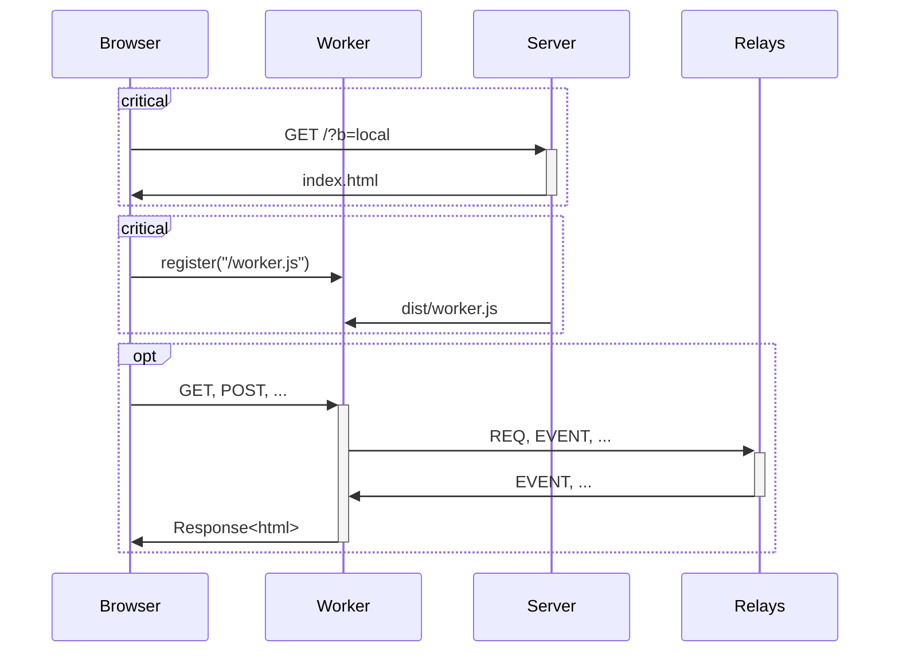
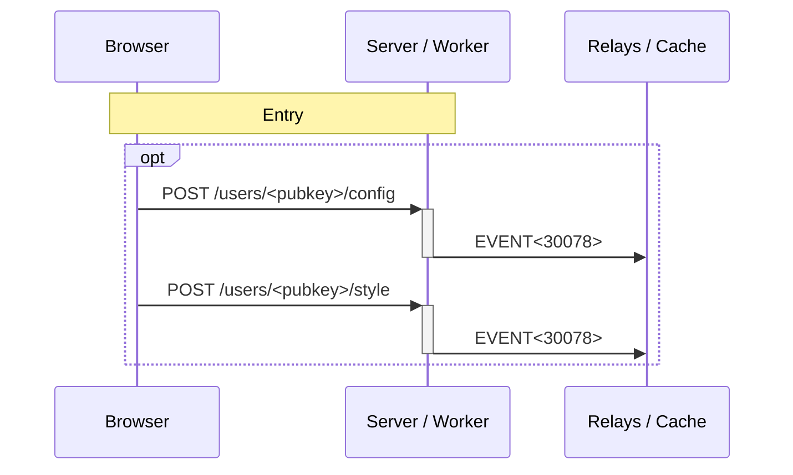
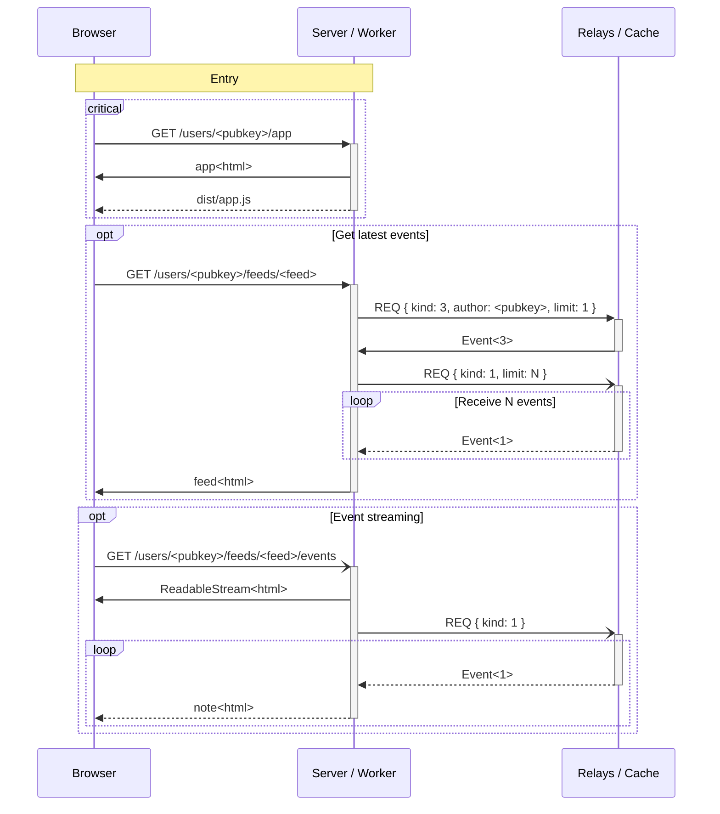

# @lophus/app

_**A Nostr client for hackers and friends**_

This package drives the development of the library while providing a real-world
example of it.

## Architecture

### Features

- No HTML rendering on the front-end (= SSR)
- Backend can be remote (Deno Deploy) or local (Service Worker)
  - Remote backend for much less data transfer and CPU usage
  - Local backend for more security and censorship resistance
- Fully-customizable multi-column UI with JSON and CSS, which can be shared with
  other users

### Entry - Remote backend mode

### Entry - Local backend (worker) mode

### Configuration

### Follows feed

